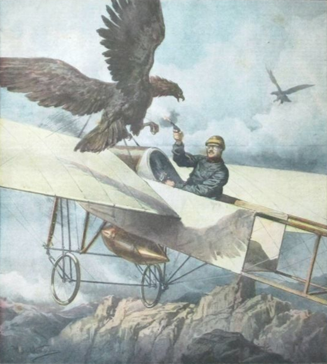

# Webathon 2025

Velkommen til Crash Simulator (aka. bird strike, se demonstrerende bilde under).

- **Nøkkelord:** Rask, smart, mange

## Spill i java

Fly og kræsj i flest mulig fugler, fly = raskt, fugler = mange, du = smart ;)

### Hvordan spille spillet

Fra menyen har du visuelle knapper som du kan klikke på. Ellers har du også muligheten til å starte spillet med Enter-knappen og å lukke vinduet med Escape-knappen.

Spillet går ut på at man prøver å kræsje i flest mulig fugler ved å flyttet spilleren (et fly) opp og ned med pil-tastene.

Hvis 10 fugler klarer å unnslippe så har du tapt.

Eventuell videreutvikling av spillet vil inkludere vanskeligere nivåer med flere typer fugler,
som beveger seg raskere. Et score-system som gjør det lettere å sammenligne high-scores er også planlagt implementert i fremtiden.

### Webathon-nøkkelord

**Rask:** Fly går ganske veldig fort. I virkeligheten i hvertfall. Her må du bruke fantasien og tenke deg at flyet beveger seg i forhold til bakgrunnen.

**Mange:** Det legges til nye fugler hvert sekund. Blir fort ganske mange det:)

**Smart:** Shhhh, ikke tenk for hardt på det.
